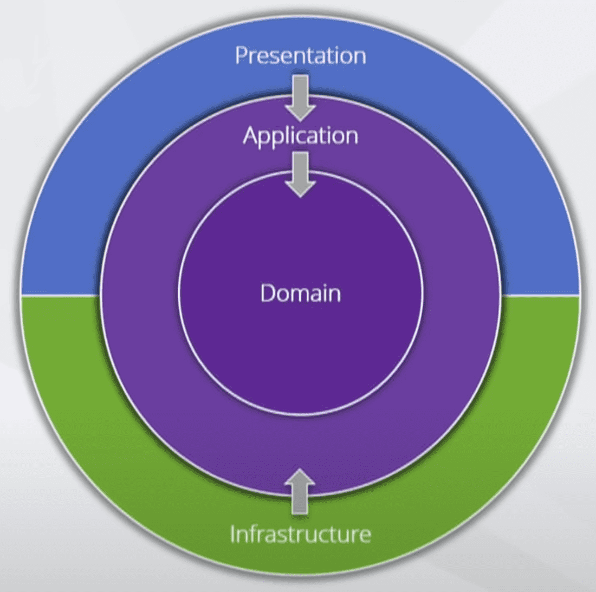

#VKTravels

# Clean Architecture
The Clean architecture approach consists of 4 layers:
* Domain
* Application
* Infrastructure
* Presentation

The projects are dependant on other but only via an inwards dependency propagation. 
For example, the presentation layer depends on the application layer but never the other way around.
Furthermore the presentation and infrastructure layers can never be dependent on each other.

### Benefits
* Independent of different frameworks
* Testable
* Independent of the UI
* Independent of the database

## Domain
Contains the enterprise logic and types that can be shared across multiple applications.

## Application
Contains business logic and types that are specific to one application.
* IRepository interfaces

## Infrastructure
* Repository implementation (of the application interface)

## Presentation
